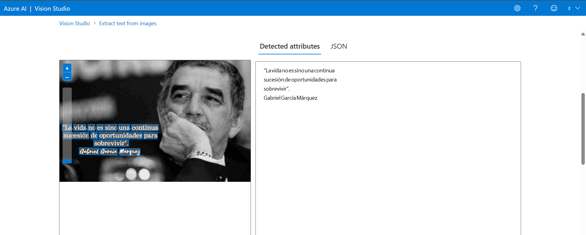

<h1 id="portugues" align="center"> Explorando os Recursos de IA Generativa com Copilot e OpenAI </h1>

[English Version](#ingles)

Instruções sobre como exploraremos os recursos da `OpenAI`, concentrando-nos tanto nos filtros de conteúdo quanto na criação.

### 🎯 Desafio de Projeto
Neste LAB, abordaremos o Copilot e exploraremos os recursos da `OpenAI`, concentrando-nos tanto nos filtros de conteúdo quanto na criação. Durante a prática, examinaremos de perto as funcionalidades dessas ferramentas, ao final do LAB, teremos uma compreensão mais aprofundada e prática desses recursos oferecidos pela `OpenAI`.

### ▶️ Intruções de Uso

**1. Introdução:**  
Este guia apresenta um passo a passo para explorar os recursos de `IA Generativa` com o `Microsoft Copilot` e `OpenAI` na Azure, incluindo filtros de conteúdo e geração de imagens.  

> ⚠️ **Nota**: Para aprofundamento, consulte sempre a **documentação oficial**:
> - [Microsoft Copilot](https://learn.microsoft.com/)  
> - [Azure OpenAI](https://learn.microsoft.com/en-us/azure/cognitive-services/openai/)  
> - [Content Filters in Azure OpenAI](https://learn.microsoft.com/en-us/azure/cognitive-services/openai/filters/)  

**2. Criação de Imagens com Microsoft Copilot:**  
Explore o potencial da IA generativa para transformar descrições em imagens, unindo criatividade e tecnologia.  

### Exemplos de Imagens Criadas:
  
  

**3. Extração de Texto a Partir de Imagens:**  
A seguir, mostramos como configurar e testar a extração de texto de imagens usando `Azure AI Services`.

- **Criando um Recurso de Serviços de IA**
1. Acesse o [Portal do Azure](https://portal.azure.com) e faça login.  
2. Clique em **+ Criar um recurso** e busque `Serviços de IA do Azure`.  
3. Escolha **Criar um Plano de Serviços de IA do Azure**.  
4. Preencha os seguintes campos:  
   - **Assinatura**: Sua assinatura ativa.  
   - **Grupo de Recursos**: Escolha ou crie um grupo.  
   - **Região**: Selecione *East US*.  
   - **Nome**: Defina um nome exclusivo.  
   - **Nível de Preços**: Escolha *Standard S0*.  
5. Marque a confirmação dos termos e clique em **Criar**.  

**4. Acessando o Vision Studio:** 
Após a implantação, entre no `Vision Studio`, clique em **View all resources** e selecione o recurso criado.  

Selecionamos o recurso e clicamos em **Select as default resource**.   

**5. Análise de Documentos:** 
Acesse a ferramenta de **Optical Character Recognition (OCR)** para testar a extração de texto.  

Clique em **Try it out**, selecione uma imagem de teste ou carregue uma do seu computador.  

### Exemplos de Entrada e Saída:  
**Input 1 & Output 1:**  
  

**Input 2 & Output 2:**  
  

Com este guia, aprendemos a explorar as funcionalidades da `IA Generativa no Azure`, desde a criação de imagens até a extração de texto com `OCR`. Essas tecnologias impulsionam a criatividade e otimizam processos em diversas áreas. Para aprofundar seus conhecimentos, explore a documentação oficial e realize seus próprios experimentos! 🚀  

### ✅ Conclusão
Este guia serve como repositório de estudos, desafios e projetos da [Bootcamp Decola Tech 2025](https://www.dio.me/bootcamp/decola-tech-2025). Explore os recursos compartilhados necessários para atender às suas necessidades da bootcamp.

       

<h1 id="ingles" align="center"> Exploring Generative AI Features with Copilot and OpenAI </h1>

[Versão em Português](#portugues)

Instructions on how we will explore the `OpenAI` features, focusing both on content filters and creation.

### 🎯 Project Challenge
In this LAB, we will cover Copilot and explore the `OpenAI` features, focusing on both content filters and creation. During the practice, we will take a closer look at the functionalities of these tools. By the end of the LAB, we will have a deeper and more practical understanding of the resources offered by `OpenAI`.

### ▶️ Usage Instructions

**1. Introduction:**  
This guide provides a step-by-step process to explore the `Generative AI` features with `Microsoft Copilot` and `OpenAI` on Azure, including content filters and image generation.  

> ⚠️ **Note**: For further details, always refer to the **official documentation**:
> - [Microsoft Copilot](https://learn.microsoft.com/)  
> - [Azure OpenAI](https://learn.microsoft.com/en-us/azure/cognitive-services/openai/)  
> - [Content Filters in Azure OpenAI](https://learn.microsoft.com/en-us/azure/cognitive-services/openai/filters/)  

**2. Image Creation with Microsoft Copilot:**  
Explore the potential of generative AI to transform descriptions into images, combining creativity and technology.

### Examples of Created Images:
  
  

**3. Extracting Text from Images:**  
Below, we show how to set up and test text extraction from images using `Azure AI Services`.

- **Creating an Azure AI Services Resource**
1. Access the [Azure Portal](https://portal.azure.com) and log in.  
2. Click **+ Create a resource** and search for `Azure AI Services`.  
3. Choose **Create an Azure AI Services Plan**.  
4. Fill in the following fields:  
   - **Subscription**: Your active subscription.  
   - **Resource Group**: Choose or create a group.  
   - **Region**: Select *East US*.  
   - **Name**: Set a unique name.  
   - **Pricing Tier**: Choose *Standard S0*.  
5. Accept the terms and click **Create**.

**4. Accessing Vision Studio:**  
After deployment, access `Vision Studio`, click **View all resources**, and select the created resource.

Select the resource and click **Select as default resource**.

**5. Document Analysis:**  
Access the **Optical Character Recognition (OCR)** tool to test text extraction.

Click **Try it out**, select a test image, or upload one from your computer.

### Input and Output Examples:  
**Input 1 & Output 1:**  
  

**Input 2 & Output 2:**  
  

With this guide, we learned how to explore `Generative AI in Azure`, from image creation to text extraction with `OCR`. These technologies boost creativity and optimize processes in various fields. To deepen your knowledge, explore the official documentation and run your own experiments! 🚀  

### ✅ Conclusion
This guide serves as a repository of studies, challenges, and projects from the [Bootcamp Decola Tech 2025](https://www.dio.me/bootcamp/decola-tech-2025). Explore the shared resources needed to meet your bootcamp requirements.
